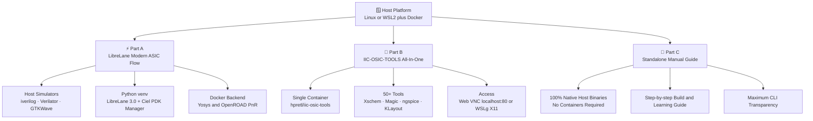
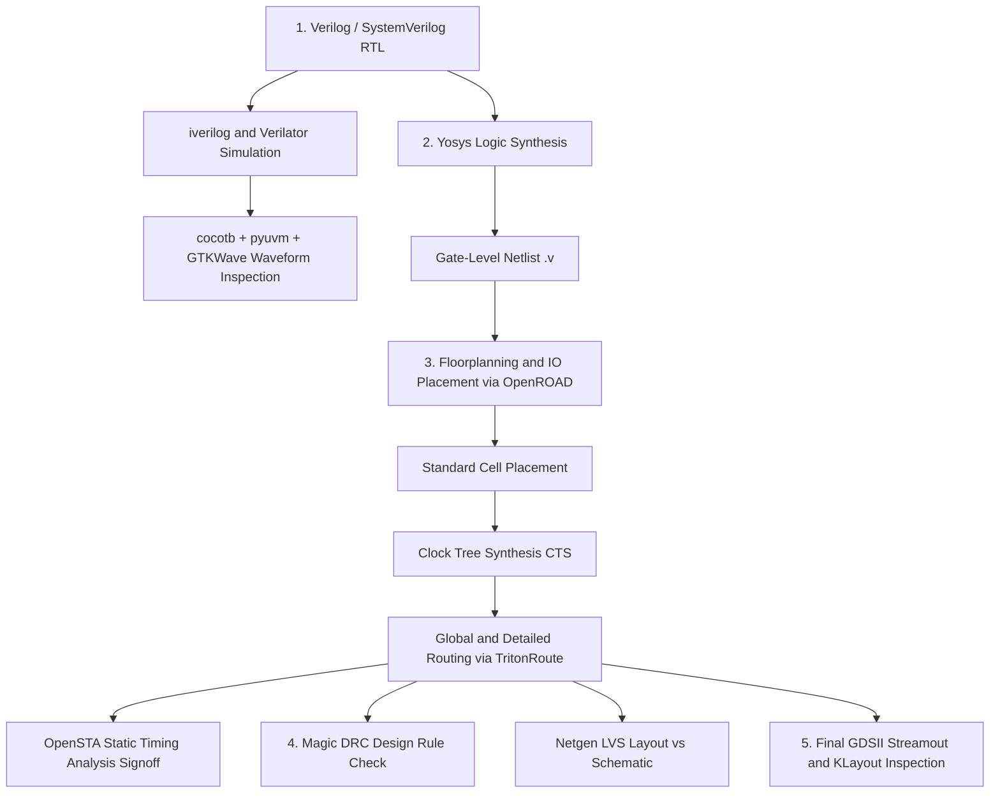

# 🚀 Open-Source VLSI / EDA Tools Installer & Learning Framework

<div align="center">

[](LICENSE)
[](README_WSL_AND_LINUX.md)
[](README_PATH_A_LIBRELANE.md)
[](README_PATH_B_IIC_OSIC_TOOLS.md)
[](examples/cocotb_test/)

---

### 📑 **Quick Navigation Tabbed Header**
Click any tab below to switch directly to its dedicated walkthrough:

| 🏠 [Main Home](README.md) | ⚡ [Part A: LibreLane](README_PATH_A_LIBRELANE.md) | 🐳 [Part B: IIC-OSIC-TOOLS](README_PATH_B_IIC_OSIC_TOOLS.md) | 📖 [Part C: Manual Guide](README_MANUAL_INSTALL.md) | 🪟 [Part D: WSL & Linux](README_WSL_AND_LINUX.md) |
| :---: | :---: | :---: | :---: | :---: |

---

</div>

A beginner-friendly, production-ready framework that sets up a verified, reproducible open-source RTL-to-GDSII IC design environment with one command—or guides you through understanding every tool by hand.

---

## 🗺️ Visual Architecture Diagram: Available Tools & Paths

The following visibility diagram maps the entire hardware design stack across **Part A**, **Part B**, **Part C**, and **Part D**:



---

## 🎯 1. Which Path Should You Choose?

> [!IMPORTANT]
> **Windows Users**: You must complete **[Part D: WSL & Linux Setup](README_WSL_AND_LINUX.md)** first to install Ubuntu and Docker Desktop before running any EDA tools.

| Path | Primary Technology | Best For | RAM (Min / Rec) | Free Disk | Approx. Time | Type |
| :--- | :--- | :--- | :--- | :--- | :--- | :--- |
| **[Part A](README_PATH_A_LIBRELANE.md)** | **LibreLane** (FOSSi Foundation) + Docker + Ciel + Host Verification | Digital ASIC designers wanting modern RTL-to-GDSII flow and fast host simulation | 8 GiB / 16 GiB | 25 GB | 15–25 min | Documented |
| **[Part B](README_PATH_B_IIC_OSIC_TOOLS.md)** | **IIC-OSIC-TOOLS** (JKU Linz) All-In-One Container | Mixed-signal & analog designers wanting an instant 50+ tool environment with VNC desktop | 8 GiB / 16 GiB | 20 GB (4GB download) | 10–20 min | Documented |
| **[Part C](README_MANUAL_INSTALL.md)** | Standalone Hand Installation (No Scripts) | Learners who want to understand every tool, build options, and flags command-by-command | 4–8 GiB / 16 GiB | 30 GB | 45–90 min | Estimate |
| **[Part D](README_WSL_AND_LINUX.md)** | Windows WSL2 & Native Linux Configuration | Prerequisite for Windows; Linux user docker group & distro guide | 4 GiB / 8 GiB | 15 GB | 10–15 min | Documented |

---

## 🐳 2. Docker Fundamentals: Concepts & Commands

### What is the difference between a Docker Image and a Docker Container?

| Term | Analogy | Technical Definition | In our EDA Flow |
| :--- | :--- | :--- | :--- |
| **Docker Image** | A **Recipe** or **Blueprint** | A read-only, immutable snapshot containing OS files, dependencies, and pre-compiled EDA tools. | `hpretl/iic-osic-tools:latest` downloaded from Docker Hub. |
| **Docker Container** | The **Cake** baked from the recipe | A runnable, running, or stopped isolated process instance created from an image. | The active desktop where you run KLayout, synthesize RTL, or simulate chips. |
| **Mounted Volume** | A **Shared Window** | A bridge that maps a directory on your physical machine directly into the container. | `$HOME/eda/designs` on host mapped to `/foss/designs` inside the container. |

### Essential Docker Commands Cheatsheet

```bash
# 1. Download/Pull an image from Docker Hub
docker pull hpretl/iic-osic-tools:latest

# 2. List all images stored on your computer
docker images

# 3. List all currently RUNNING containers
docker ps

# 4. List ALL containers (including stopped ones)
docker ps -a

# 5. Stop a running container
docker stop <container_id_or_name>

# 6. Exit a running interactive shell container
exit      # Or press Ctrl+D

# 7. Clean up stopped containers and dangling images to free disk space
docker system prune -f
```

---

## ⚡ 3. Quick Start per Operating System

### 🪟 Windows 10 / 11 Users
1. Open PowerShell as **Administrator**.
2. Run the automated Windows preparation script:
```powershell
Set-ExecutionPolicy RemoteSigned -Scope Process
.\scripts\wsl\wsl_setup.ps1 -Path a
```
3. Read the detailed walkthrough in [README_WSL_AND_LINUX.md](README_WSL_AND_LINUX.md).

### 🐧 Linux Users (Ubuntu, Debian, Fedora, Arch)
Clone the repo and run the master installer:
```bash
git clone https://github.com/Saicharan-malyala/opensource-vlsi-toolkit.git
cd opensource-vlsi-toolkit
chmod +x install_all.sh doctor.sh lib/*.sh scripts/*/*.sh scripts/*/*/*.sh
./install_all.sh
```
Select `[1]` for Part A (LibreLane) or `[2]` for Part B (IIC-OSIC-TOOLS).

---

## 🔬 4. RTL-to-GDSII ASIC Flow Pipeline



---

## 📊 5. Tool Allocation & Purpose Matrix

| Tool | Flow Stage | Primary Purpose in One Line | Part A | Part B | Part C |
| :--- | :--- | :--- | :---: | :---: | :---: |
| **Git** | Foundation | Distributed version control (tool; GitHub is service) | Host | Host | Host |
| **GNU Make** | Foundation | Build automation and simulation target orchestrator | Host | Container | Host |
| **Python 3** | Foundation | Python runtime with venv, pip, and Tkinter GUI support | Host | Container | Host |
| **Docker Engine** | Runtime | Container runtime executing ASIC flow pipelines | Host | Host | Optional |
| **Icarus Verilog** | RTL Simulation | IEEE-1364 Verilog compiler and fast event-driven simulator | Host | Container | Host |
| **Verilator** | Simulation & Lint | Fast C++ hardware cycle simulation and linting | Host | Container | Host |
| **GTKWave** | Analysis | Graphical waveform viewer for VCD/FST simulation dumps | Host | Container | Host |
| **cocotb / pyuvm** | Verification | Coroutine Python testbench and UVM verification | Host | Container | Host |
| **LibreLane** | Flow Manager | Modern digital ASIC RTL-to-GDSII flow manager | Venv+Docker | Container | Manual |
| **Ciel** | PDK Manager | Official package manager for pre-built open-source PDKs | Venv | Container | Host |
| **Sky130 PDK** | Process Kit | Google & SkyWater 130nm open-source semiconductor PDK | Local Ciel | Container | Local Ciel |
| **Yosys** | Synthesis | RTL synthesis framework mapping Verilog to gate netlist | Container | Container | Host |
| **OpenROAD** | P&R | Autonomous physical design from floorplan to routing | Container | Container | Prebuilt/Host |
| **OpenSTA** | Timing | Static Timing Analysis (STA) and timing signoff engine | Container | Container | Host |
| **Magic** | Layout & DRC | VLSI layout editor, DRC, and parasitics extraction | Container | Container | Host |
| **Netgen** | LVS | Layout Versus Schematic comparison and verification | Container | Container | Host |
| **KLayout** | Layout Viewer | High-performance GDSII/OASIS mask layout viewer | Host | Container | Host |
| **ngspice** | Analog SPICE | General-purpose circuit simulation for analog/mixed-signal | Host | Container | Host |
| **Xschem** (opt) | Schematic | Schematic capture program for circuit design and netlisting | Opt Host | Container | Host |
| **gh** (opt) | GitHub CLI | Official GitHub command-line interface tool | Host | Host | Host |

---

## 🗂️ 6. Repository Structure

```text
.
├── LICENSE                             # MIT License for repository installer scripts
├── CREDITS.md                          # Full upstream credits, links, and licensing notes
├── README.md                           # Main entry point and architecture walkthrough
├── README_PATH_A_LIBRELANE.md          # Part A: LibreLane modern flow walkthrough
├── README_PATH_B_IIC_OSIC_TOOLS.md     # Part B: IIC-OSIC-TOOLS all-in-one container flow
├── README_MANUAL_INSTALL.md            # Part C: Standalone manual guide (references no scripts)
├── README_WSL_AND_LINUX.md             # Part D: Windows WSL2 setup and Linux system notes
├── versions.env                        # Central version pinning configuration (never hardcoded)
├── install_all.sh                      # Root interactive & CLI entry point (--path a|b|manual)
├── doctor.sh                           # Diagnostic health verification tool (read-only, never installs)
├── lib/
│   ├── common.sh                       # Shared helpers: logging, sudo prompts, dry-run, pkg manager
│   └── README.md                       # Documentation for common library
├── scripts/
│   ├── README.md                       # Overview of modular scripts
│   ├── path_a/
│   │   ├── install_path_a.sh           # Part A orchestrator (host tools + LibreLane + Ciel)
│   │   ├── run_counter.sh              # Runner for example 4-bit counter design
│   │   └── README.md                   # Documentation for Part A scripts
│   ├── path_b/
│   │   ├── install_path_b.sh           # Part B orchestrator (container pull + gap check)
│   │   └── README.md                   # Documentation for Part B scripts
│   ├── tools/                          # Individual reusable tool installer and verifier blocks
│   │   ├── git.sh, make.sh, python.sh, docker.sh, iverilog.sh, verilator.sh,
│   │   ├── gtkwave.sh, ngspice.sh, cocotb.sh, librelane.sh, ciel.sh,
│   │   ├── yosys.sh, openroad.sh, opensta.sh, magic.sh, netgen.sh, klayout.sh,
│   │   ├── gh.sh, xschem.sh
│   │   └── README.md                   # Documentation for individual tool scripts
│   ├── optional/
│   │   ├── github_setup.sh             # Optional Git identity and GitHub CLI setup
│   │   └── README.md                   # Documentation for optional utilities
│   └── wsl/
│       ├── wsl_setup.ps1               # Automated Windows PowerShell WSL2 & Ubuntu installer
│       └── README.md                   # Documentation for Windows WSL setup
└── examples/
    ├── README.md                       # Overview of example designs
    ├── counter/                        # Synthesizable 4-bit synchronous counter RTL & LibreLane config
    │   ├── counter.v
    │   └── config.json
    └── cocotb_test/                    # Python-based cocotb testbench and Makefile
        ├── test_counter.py
        └── Makefile
```

---

## 🛠️ 7. Script Flags and Diagnostic Usage

All automation scripts support standard execution flags:
- `--dry-run`: Prints exact commands that would be executed without running them.
- `--yes`: Skips interactive confirmation prompts (useful for CI and unattended runs).
- `--help`: Displays parameter usage and instructions.

### Running System Health Verification
To inspect your installed tools without modifying your system:
```bash
./doctor.sh
```
`doctor.sh` produces a structured PASS/FAIL diagnostic table and exits with code 0 on healthy environments or non-zero on failure.

---

## ⚙️ 8. Version Configuration (`versions.env`)

All version pins, tags, and minimum requirements reside in [`versions.env`](versions.env).
To override or update any tool version, edit the corresponding variable in `versions.env`. Pre-releases or dev builds are never pinned.

---

## 🚫 9. What is NOT Included

- **Commercial EDA Tools**: Proprietary vendor tools (Synopsys, Cadence, Siemens EDA) are outside the open-source scope.
- **macOS Native Toolchain**: macOS is not natively supported by the host automation scripts; macOS users must use Docker Desktop with Part B.
- **ARM64 Native Host Compilations**: Prebuilt binaries for OpenROAD target `x86_64` (amd64); for ARM64 machines (such as Apple Silicon), Part B's container is recommended.

---

## 🤝 10. Credits and Contributions

Please read [CREDITS.md](CREDITS.md) for full acknowledgment of upstream projects, including the FOSSi Foundation, JKU Linz, The OpenROAD Project, and Google/SkyWater.

Contributions, bug reports, and pull requests are welcome!
