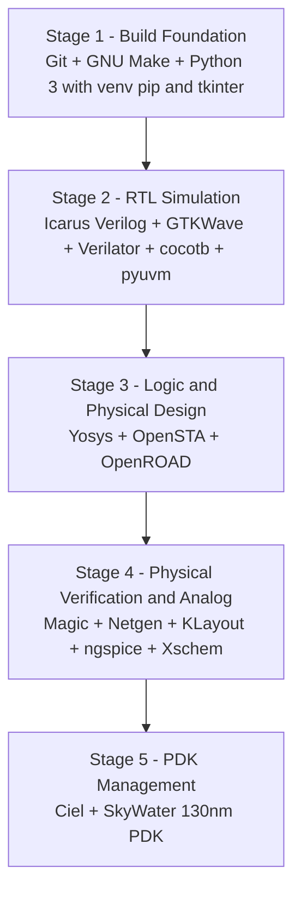

# 📖 Part C: Standalone Manual Installation & Learning Guide

<div align="center">

### 📑 **Quick Navigation Tabbed Header**
| 🏠 [Main Home](README.md) | ⚡ [Part A: LibreLane](README_PATH_A_LIBRELANE.md) | 🐳 [Part B: IIC-OSIC-TOOLS](README_PATH_B_IIC_OSIC_TOOLS.md) | 📖 [Part C: Manual Guide](README_MANUAL_INSTALL.md) | 🪟 [Part D: WSL & Linux](README_WSL_AND_LINUX.md) |
| :---: | :---: | :---: | :---: | :---: |

---

</div>

> [!IMPORTANT]
> **STANDALONE GUIDE NOTICE:**
> This document is an entirely independent, self-contained educational manual.
> It requires only a terminal and this single document. It does NOT depend on, link to, or execute any automation script, repository directory, or configuration file.
>
> **Do not mix manual tool installations with Part A or Part B environments unless you have a specific reason: versions and library paths may differ.**

---

## 🗺️ Part C Visual Installation & Hand Execution Map



---

## 🎯 Recommended Learning Order

For beginners learning IC design, install and master the toolchain in this logical progression:
1. **System & Build Foundations**: Git, GNU Make, Python 3 (venv, pip, tkinter)
2. **RTL Simulation & Waveforms**: Icarus Verilog (`iverilog`), GTKWave
3. **Advanced RTL Verification**: cocotb, pyuvm, Verilator
4. **Logic Synthesis**: Yosys
5. **Static Timing Analysis (STA)**: OpenSTA
6. **Physical Design & Place & Route (P&R)**: OpenROAD
7. **Physical Verification**: Magic (Layout/DRC), Netgen (LVS)
8. **Layout Viewing & GDSII Inspection**: KLayout
9. **Analog / Mixed-Signal**: ngspice, Xschem
10. **PDK Package Management**: Ciel (SkyWater 130nm)

---

## 1. Git (Version Control)

- **What it is**: Distributed version control system used to track changes in source code and hardware descriptions.
- **Flow Stage**: Foundations / Version Control.
- **Resource Usage**: ~100 MB RAM | ~50 MB Disk | < 1 minute (Documented).

### Installation by Package Manager
```bash
# Ubuntu / Debian
sudo apt update
sudo apt install -y git

# Fedora / RHEL
sudo dnf install -y git

# Arch Linux
sudo pacman -Sy --noconfirm git
```

### Hand Verification
```bash
git --version
```
*Expected Output Shape:*
```text
git version 2.45.2 (or higher)
```

### Tiny Functional Test
```bash
git init /tmp/git_test && cd /tmp/git_test && git status && rm -rf /tmp/git_test
```

### Common Errors & Fixes
- `git: command not found`: Ensure your package manager update succeeded and PATH contains `/usr/bin`.

---

## 2. GNU Make (Build Automation)

- **What it is**: Tool that controls the generation of executables and simulation targets from source files via Makefiles.
- **Flow Stage**: Foundations / Automation.
- **Resource Usage**: ~50 MB RAM | ~20 MB Disk | < 1 minute (Documented).

### Installation by Package Manager
```bash
# Ubuntu / Debian
sudo apt update
sudo apt install -y make build-essential

# Fedora / RHEL
sudo dnf install -y make

# Arch Linux
sudo pacman -Sy --noconfirm make
```

### Hand Verification
```bash
make --version
```
*Expected Output Shape:*
```text
GNU Make 4.3 (or higher)
```

### Tiny Functional Test
```bash
echo -e "all:\n\t@echo 'make is functional'" | make -f -
```

---

## 3. Python 3, Pip, Venv, and Tkinter

- **What it is**: Modern Python runtime required by verification frameworks (cocotb) and EDA GUIs (Tkinter).
- **Flow Stage**: Foundations / Python Ecosystem.
- **Resource Usage**: ~200 MB RAM | ~300 MB Disk | 2 minutes (Documented).

### Installation by Package Manager
```bash
# Ubuntu / Debian
sudo apt update
sudo apt install -y python3 python3-pip python3-venv python3-tk

# Fedora / RHEL
sudo dnf install -y python3 python3-pip python3-tkinter

# Arch Linux
sudo pacman -Sy --noconfirm python python-pip tk
```

### Hand Verification
```bash
python3 -c "import sys, venv, tkinter; print(f'Python {sys.version.split()[0]} ready with Tkinter')"
```
*Expected Output Shape:*
```text
Python 3.10.x (or higher) ready with Tkinter
```

---

## 4. Icarus Verilog (`iverilog`)

- **What it is**: IEEE-1364 compliant Verilog simulation and synthesis tool.
- **Flow Stage**: RTL Simulation.
- **Resource Usage**: ~200 MB RAM | ~50 MB Disk | 1 minute (Documented).

### Installation by Package Manager
```bash
# Ubuntu / Debian
sudo apt update
sudo apt install -y iverilog

# Fedora / RHEL
sudo dnf install -y iverilog

# Arch Linux
sudo pacman -Sy --noconfirm iverilog
```

### Hand Verification
```bash
iverilog -V | head -n1
```
*Expected Output Shape:*
```text
Icarus Verilog version 12.0 (or higher)
```

### Tiny Functional Test
```bash
cat << 'EOF' > /tmp/sim_test.v
module top;
  initial begin
    $display("IVERILOG_WORKING");
    $finish;
  end
endmodule
EOF
iverilog -o /tmp/sim_test.vvp /tmp/sim_test.v
vvp /tmp/sim_test.vvp
rm -f /tmp/sim_test.v /tmp/sim_test.vvp
```

---

## 5. GTKWave (Waveform Viewer)

- **What it is**: Fully featured GTK-based wave viewer for VCD, LXT, and FST simulation dumps.
- **Flow Stage**: Simulation Analysis / Waveform Inspection.
- **Resource Usage**: ~250 MB RAM | ~80 MB Disk | 1 minute (Documented).

### Installation by Package Manager
```bash
# Ubuntu / Debian
sudo apt update
sudo apt install -y gtkwave

# Fedora / RHEL
sudo dnf install -y gtkwave

# Arch Linux
sudo pacman -Sy --noconfirm gtkwave
```

### Hand Verification
```bash
gtkwave --version | head -n1
```
*Expected Output Shape:*
```text
GTKWave Analyzer v3.3.118 (or higher)
```

---

## 6. Verilator (C++ Cycle Simulator & Linter)

- **What it is**: High-performance Verilog/SystemVerilog simulator that compiles hardware designs into optimized C++ models.
- **Flow Stage**: Fast Cycle Simulation & Linting.
- **Resource Usage**: ~1 GB RAM during C++ compilation | ~150 MB Disk | 2 minutes (Documented).

### Installation by Package Manager
```bash
# Ubuntu / Debian
sudo apt update
sudo apt install -y verilator

# Fedora / RHEL
sudo dnf install -y verilator

# Arch Linux
sudo pacman -Sy --noconfirm verilator
```

### Hand Verification
```bash
verilator --version
```
*Expected Output Shape:*
```text
Verilator 5.030 (or higher)
```

### Tiny Functional Test
```bash
cat << 'EOF' > /tmp/lint_test.v
module lint_test(input wire a, output wire y);
  assign y = a;
endmodule
EOF
verilator --lint-only -Wall /tmp/lint_test.v
rm -f /tmp/lint_test.v
```

---

## 7. cocotb & pyuvm (Python Verification)

- **What it is**: Coroutine-based cosimulation framework using Python to drive Verilog simulators via VPI.
- **Flow Stage**: Functional Verification.
- **Resource Usage**: ~200 MB RAM | ~100 MB Disk | 2 minutes (Documented).

### Installation via Python Virtual Environment
```bash
# Create and activate an isolated virtual environment
python3 -m venv ~/my_eda_env
source ~/my_eda_env/bin/activate
pip install --upgrade pip
pip install cocotb pyuvm
```

### Hand Verification
```bash
python3 -c "import cocotb, pyuvm; print(f'cocotb={cocotb.__version__}, pyuvm={pyuvm.__version__}')"
```
*Expected Output Shape:*
```text
cocotb=1.9.x, pyuvm=0.3.x
```

---

## 8. Yosys (RTL Synthesis)

- **What it is**: Framework for Verilog RTL synthesis, mapping behavioral Verilog to gate-level logic or target cell libraries.
- **Flow Stage**: Logic Synthesis.
- **Resource Usage**: 
  - Binary install: ~500 MB RAM | ~150 MB Disk | 1 minute (Documented).
  - Source build: ~4 GB RAM | ~2 GB Disk | 15–30 minutes (Estimate).

### Installation: Distro Package (Recommended)
```bash
# Ubuntu / Debian
sudo apt update
sudo apt install -y yosys

# Fedora / RHEL
sudo dnf install -y yosys

# Arch Linux
sudo pacman -Sy --noconfirm yosys
```

### Building from Source (Fallback)
> [!WARNING]
> Compiling Yosys requires ~4 GB RAM. Limit compilation threads with `-j 2` or `-j 4` to prevent Out-Of-Memory crashes.
```bash
sudo apt install -y build-essential clang bison flex libreadline-dev gawk tcl-dev libffi-dev git graphviz pkg-config python3 libboost-system-dev libboost-python-dev libboost-filesystem-dev zlib1g-dev
git clone https://github.com/YosysHQ/yosys.git
cd yosys
make config-gcc
make -j 4
sudo make install
```

### Hand Verification
```bash
yosys -V
```
*Expected Output Shape:*
```text
Yosys 0.68 (or higher)
```

### Tiny Functional Test
```bash
cat << 'EOF' > /tmp/synth_test.v
module synth_test(input a, input b, output y);
  assign y = a & b;
endmodule
EOF
yosys -p "read_verilog /tmp/synth_test.v; synth; stat"
rm -f /tmp/synth_test.v
```

---

## 9. OpenROAD (RTL-to-GDSII Physical Design)

- **What it is**: Autonomous, integrated physical design tool providing floorplanning, placement, clock tree synthesis (CTS), and global/detailed routing.
- **Flow Stage**: Place and Route (P&R).
- **Resource Usage**:
  - Prebuilt binary: ~4 GB RAM min (16 GB rec) | ~1 GB Disk | 5 minutes (Documented).
  - Source build: ~8–16 GB RAM | ~10 GB Disk | 40–90 minutes (Estimate).

### Installation: Prebuilt Binary (Recommended)
The OpenROAD Project provides official prebuilt `.deb` releases:
```bash
# Example for Ubuntu 22.04 / Debian (Check OpenROAD release page for latest URL)
wget https://github.com/The-OpenROAD-Project/OpenROAD/releases/download/v2.0-16503/openroad_2.0-16503_amd64-ubuntu-22.04.deb
sudo apt install -y ./openroad_2.0-16503_amd64-ubuntu-22.04.deb
```

### Building from Source with Bazel (Fallback)
```bash
git clone --recursive https://github.com/The-OpenROAD-Project/OpenROAD.git
cd OpenROAD
sudo ./etc/DependencyInstaller.sh
bazel build //src:openroad --jobs=4
```

### Hand Verification
```bash
openroad -version
```
*Expected Output Shape:*
```text
OpenROAD v2.0-xxxxx
```

### Tiny Functional Test
```bash
echo "exit" | openroad
```

---

## 10. OpenSTA (Static Timing Analysis)

- **What it is**: Gate-level static timing analyzer used for timing closure and delay calculation.
- **Flow Stage**: Static Timing Analysis.
- **Resource Usage**: ~500 MB RAM | ~100 MB Disk | 1 minute (Estimate).

### Installation: Built with OpenROAD or Standalone
*Note: OpenROAD includes OpenSTA internally. If you need the standalone `sta` binary:*
```bash
git clone https://github.com/The-OpenROAD-Project/OpenSTA.git
cd OpenSTA
mkdir build && cd build
cmake ..
make -j 4
sudo make install
```

### Hand Verification
```bash
sta -version
```

---

## 11. Magic (Layout Editor & DRC)

- **What it is**: Interactive layout editor and extraction tool for VLSI, with real-time design rule checking (DRC).
- **Flow Stage**: Layout Viewing, DRC, Extraction.
- **Resource Usage**: ~500 MB RAM | ~100 MB Disk | 2 minutes (Documented).

### Installation by Package Manager
```bash
# Ubuntu / Debian
sudo apt update
sudo apt install -y magic

# Arch Linux
sudo pacman -Sy --noconfirm magic
```

### Hand Verification
```bash
magic --version
```
*Expected Output Shape:*
```text
8.3.498 (or higher)
```

### Tiny Functional Test
```bash
echo "quit" | magic -dnull -noconsole
```

---

## 12. Netgen (LVS - Layout Versus Schematic)

- **What it is**: Tool for comparing netlists, primarily used for Layout Versus Schematic (LVS) verification.
- **Flow Stage**: LVS Physical Verification.
- **Resource Usage**: ~300 MB RAM | ~50 MB Disk | 1 minute (Documented).

### Installation by Package Manager
```bash
# Ubuntu / Debian
sudo apt update
sudo apt install -y netgen-lvs || sudo apt install -y netgen
```

### Hand Verification
```bash
netgen -batch eval "exit"
```

---

## 13. KLayout (GDSII / OASIS Viewer & DRC)

- **What it is**: High-performance mask layout viewer and editor supporting GDSII, OASIS, and ruby/python scripting.
- **Flow Stage**: Layout Inspection & Visual DRC.
- **Resource Usage**: ~500 MB RAM | ~200 MB Disk | 2 minutes (Documented).

### Installation by Package Manager
```bash
# Ubuntu / Debian
sudo apt update
sudo apt install -y klayout

# Fedora / RHEL
sudo dnf install -y klayout

# Arch Linux
sudo pacman -Sy --noconfirm klayout
```

### Hand Verification
```bash
klayout -v
```
*Expected Output Shape:*
```text
KLayout 0.29.x (or higher)
```

### Tiny Functional Test
```bash
klayout -b -c "exit"
```

---

## 14. ngspice (SPICE Circuit Simulator)

- **What it is**: Open-source general-purpose circuit simulation program for nonlinear DC, nonlinear transient, and linear AC analysis.
- **Flow Stage**: Analog / Mixed-Signal Simulation.
- **Resource Usage**: ~300 MB RAM | ~100 MB Disk | 1 minute (Documented).

### Installation by Package Manager
```bash
# Ubuntu / Debian
sudo apt update
sudo apt install -y ngspice

# Fedora / RHEL
sudo dnf install -y ngspice

# Arch Linux
sudo pacman -Sy --noconfirm ngspice
```

### Hand Verification
```bash
ngspice --version | head -n1
```

### Tiny Functional Test
```bash
cat << 'EOF' > /tmp/rc.cir
* Simple RC Test
V1 in 0 5
R1 in out 1k
C1 out 0 1u
.tran 0.1m 2m
.control
run
quit
.endc
.end
EOF
ngspice -b /tmp/rc.cir
rm -f /tmp/rc.cir
```

---

## 15. Ciel (PDK Package Manager) & Sky130 PDK

- **What it is**: The official FOSSi Foundation PDK package manager (successor to Volare) that downloads pre-built open-source PDKs without manual compiling.
- **Flow Stage**: Process Design Kit (PDK) Setup.
- **Resource Usage**: ~500 MB RAM | ~4 GB Disk (for Sky130A) | 5–10 minutes download (Documented).

### Installation
```bash
pip install ciel
```

### Enable Sky130 PDK
```bash
ciel enable --pdk-family=sky130
```

### Hand Verification
```bash
ciel --version
ciel ls --pdk-family=sky130
```

---

## 🔍 Complete Verification Loop (Copy-Paste)

Copy and run this loop in your terminal to verify all manually installed tools at once:

```bash
echo "=== EDA TOOLS COMPREHENSIVE STATUS CHECK ==="
for cmd in git make python3 iverilog verilator gtkwave yosys magic klayout ngspice ciel; do
    if command -v "$cmd" >/dev/null 2>&1; then
        echo -e "[PASS] $cmd: \t$("$cmd" --version 2>&1 | head -n1)"
    else
        echo -e "[FAIL] $cmd is NOT on PATH"
    fi
done
```
