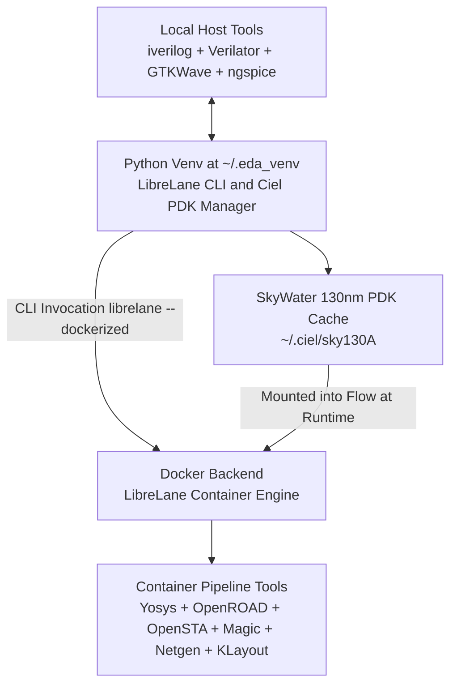

# ⚡ Part A: LibreLane Modern ASIC Implementation Flow

<div align="center">

### 📑 **Quick Navigation Tabbed Header**
| 🏠 [Main Home](README.md) | ⚡ [Part A: LibreLane](README_PATH_A_LIBRELANE.md) | 🐳 [Part B: IIC-OSIC-TOOLS](README_PATH_B_IIC_OSIC_TOOLS.md) | 📖 [Part C: Manual Guide](README_MANUAL_INSTALL.md) | 🪟 [Part D: WSL & Linux](README_WSL_AND_LINUX.md) |
| :---: | :---: | :---: | :---: | :---: |

---

</div>

This guide walks through **Part A**: setting up the modern, open-source RTL-to-GDSII digital ASIC flow using **LibreLane** (official Apache-2.0 successor to OpenLane under the FOSSi Foundation), managed PDKs via **Ciel** (successor to Volare), and local simulation/verification tools on the host.

---

## 🗺️ Part A Visual Installation & Execution Map



---

## 🏗️ 1. Architecture: Tool Allocation Table

To prevent redundancy and conflicts, tools are partitioned between the containerized ASIC flow and the host environment:

| Tool | Where It Runs | Purpose | Why This Location? |
| :--- | :--- | :--- | :--- |
| **LibreLane** | Python Venv (`~/.eda_venv`) + Docker | Flow orchestration & pipeline manager | Host CLI invokes containerized engine |
| **Ciel** | Python Venv (`~/.eda_venv`) | PDK package & version manager | Fetches & enables pre-built Sky130 PDK |
| **Sky130 PDK** | `~/.ciel/sky130A` | Process Design Kit (Google & SkyWater) | Downloaded once by Ciel, mounted into flow |
| **Yosys** | Inside LibreLane Container | RTL Synthesis | Provided by upstream flow container |
| **OpenROAD** | Inside LibreLane Container | Floorplanning, Placement, CTS, Routing | Provided by upstream flow container |
| **OpenSTA** | Inside LibreLane Container | Static Timing Analysis (STA) | Provided by upstream flow container |
| **Magic** | Inside LibreLane Container | DRC & GDS extraction | Provided by upstream flow container |
| **Netgen** | Inside LibreLane Container | LVS (Layout Vs Schematic) | Provided by upstream flow container |
| **KLayout** | Inside LibreLane Container & Host | GDSII layout viewer & DRC verification | Stream viewing and export |
| **Icarus Verilog** | Host Machine | RTL simulation | Fast, lightweight host simulation |
| **Verilator** | Host Machine | Fast C++ linting and cycle simulation | Immediate terminal feedback |
| **GTKWave** | Host Machine | Waveform inspection (`.vcd` / `.fst`) | Native host GUI rendering |
| **ngspice** | Host Machine | Mixed-signal / SPICE simulation | Host circuit analysis |
| **cocotb / pyuvm** | Python Venv (`~/.eda_venv`) | Modern Python-based testbenches | Co-simulates directly with host iverilog |
| **GNU Make / Git** | Host Machine | Build automation & version control | System build utilities |

---

## 📈 2. Resource Requirements

| Component | Minimum RAM | Recommended RAM | Free Disk Space | Approximate Time | Type |
| :--- | :--- | :--- | :--- | :--- | :--- |
| **LibreLane Flow Setup** | 8 GiB | 16 GiB | 25 GB | 15–25 minutes | Documented |
| **Sky130 PDK Download** | 2 GiB | 4 GiB | ~4 GB | 5–10 minutes | Documented |
| **Host Toolchain** | 2 GiB | 4 GiB | 3 GB | 5 minutes | Estimate |

---

## 🚀 3. Installation Walkthrough

### Option 1: Automated Script
Run the automated installer with Part A selected:
```bash
./install_all.sh --path a
```
*Flags supported: `--dry-run` (simulate without changes), `--yes` (accept prompts).*

### Option 2: Step-by-Step Manual Execution

#### Step 1: Install Host Prerequisites
Ensure Docker, Git, Make, and Python 3 with Tkinter are installed:
```bash
sudo apt update && sudo apt install -y git make python3 python3-pip python3-venv python3-tk docker.io
sudo usermod -aG docker $USER
newgrp docker
```

#### Step 2: Install Host Simulation Tools
```bash
sudo apt install -y iverilog verilator gtkwave ngspice
```

#### Step 3: Set Up Dedicated Python Virtual Environment
```bash
python3 -m venv ~/.eda_venv
source ~/.eda_venv/bin/activate
pip install --upgrade pip
```

#### Step 4: Install Ciel and LibreLane
```bash
pip install ciel librelane
```

#### Step 5: Enable the Sky130 PDK
```bash
ciel enable --pdk-family=sky130
```
*PDK files are stored at `~/.ciel/`.*

#### Step 6: Verify Installation (Smoke Test)
```bash
librelane --dockerized --smoke_test
```
**Expected Output:**
```text
[INFO] Smoke test completed successfully.
```

---

## 🔬 4. Running Your First Design: 4-Bit Counter

This repository includes a tested counter example in [`examples/counter`](examples/counter).

### Step 1: Run Cocotb RTL Verification
```bash
cd examples/cocotb_test
source ~/.eda_venv/bin/activate
make
```
**Expected Output:**
```text
** TEST PASSED **
test_counter_basic passed
```

### Step 2: Run Full RTL-to-GDSII ASIC Flow
```bash
./scripts/path_a/run_counter.sh
```
Or execute directly:
```bash
source ~/.eda_venv/bin/activate
librelane --dockerized examples/counter
```
The resulting GDSII and reports will be placed in `examples/counter/runs/`.

---

## 🔧 5. Alternative Execution Engines

- **Nix Engine (Recommended by FOSSi Foundation)**:
  If you prefer Nix over Docker, pass the `--nix` flag to `./scripts/path_a/install_path_a.sh --nix`.
- **AppImage**:
  LibreLane also provides portable AppImage bundles on their [GitHub Releases](https://github.com/librelane/librelane/releases).

---

## 🛠️ 6. Troubleshooting Part A

| Symptom | Cause | Solution |
| :--- | :--- | :--- |
| `docker: permission denied` | User not in docker group | Run `sudo usermod -aG docker $USER && newgrp docker`. |
| `librelane: command not found` | Virtual environment not active | Run `source ~/.eda_venv/bin/activate`. |
| `PDK not found` | Ciel PDK not enabled or missing `PDK_ROOT` | Run `ciel enable --pdk-family=sky130` and ensure `PDK_ROOT=~/.ciel`. |
| `ModuleNotFoundError: No module named '_tkinter'` | Missing `python3-tk` package | Run `sudo apt install python3-tk`. |
| Out of memory kill during routing | Insufficient RAM allocated | Allocate at least 8 GB RAM in `.wslconfig` or system swap. |
