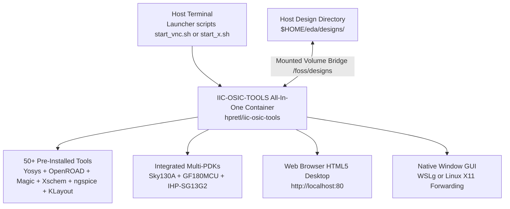

# 🐳 Part B: IIC-OSIC-TOOLS (All-In-One Container Flow)

<div align="center">

### 📑 **Quick Navigation Tabbed Header**
| 🏠 [Main Home](README.md) | ⚡ [Part A: LibreLane](README_PATH_A_LIBRELANE.md) | 🐳 [Part B: IIC-OSIC-TOOLS](README_PATH_B_IIC_OSIC_TOOLS.md) | 📖 [Part C: Manual Guide](README_MANUAL_INSTALL.md) | 🪟 [Part D: WSL & Linux](README_WSL_AND_LINUX.md) |
| :---: | :---: | :---: | :---: | :---: |

---

</div>

This guide covers **Part B**: running the complete open-source IC design toolchain via the **IIC-OSIC-TOOLS** container curated by Johannes Kepler University (JKU) Linz.

---

## 🗺️ Part B Visual Installation & Execution Map



---

## 🌟 1. What is IIC-OSIC-TOOLS?

The `hpretl/iic-osic-tools` Docker container packages over 50 EDA tools, analog/digital design flows, and multiple Process Design Kits (PDKs) into a unified, reproducible Ubuntu 24.04 environment supporting both `x86_64` (amd64) and `aarch64` (arm64).

### Key Features
- **PDKs Pre-Installed**:
  - `sky130A` (SkyWater 130nm)
  - `gf180mcuD` (GlobalFoundries 180nm)
  - `ihp-sg13g2` (IHP 130nm BiCMOS)
  - `ihp-sg13cmos5l` (IHP 130nm CMOS)
- **Built-in Desktops**:
  - Browser-accessible HTML5 VNC desktop at `http://localhost:80`.
  - Local X11 / Wayland forwarding mode (for WSLg on Windows and native Linux).
  - Headless shell mode.
- **PDK Switcher**: Includes the `sak-pdk` tool to easily switch active PDK environments.

---

## 📊 2. Resource Requirements

| Resource | Minimum | Recommended | Notes | Type |
| :--- | :--- | :--- | :--- | :--- |
| **RAM** | 8 GiB | 16 GiB | Required for running heavy synthesis or GUI tools | Documented |
| **Download Size** | ~4 GB | ~4 GB | Compressed container image from Docker Hub | Documented |
| **Free Disk Space** | 20 GB | 30 GB | Container uncompressed + user design work | Documented |
| **Setup Time** | 10 min | 20 min | Depends on internet download speed | Estimate |

---

## 🚀 3. Installation Walkthrough

### Option 1: Automated Script
```bash
./install_all.sh --path b
```
What the script does:
1. Verifies host prerequisites (`git`, `docker`, optional `gh`).
2. Checks for 20 GB free disk space.
3. Clones the upstream IIC-OSIC-TOOLS launcher scripts into `upstream_iic_osic_tools/` (without modifying them).
4. Pulls `hpretl/iic-osic-tools:latest`.
5. Runs an automated **GAP CHECK** inside the container to ensure all user tools are present, installing any missing tools on the host.

### Option 2: Upstream Interactive Installer
Upstream provides an installer script referenced at `https://github.com/iic-jku/IIC-OSIC-TOOLS`:
```bash
# Clone upstream launcher repository
git clone --depth=1 https://github.com/iic-jku/IIC-OSIC-TOOLS.git
cd IIC-OSIC-TOOLS
```

---

## 🖥️ 4. Launching the Environment

Upstream provides three dedicated launcher scripts inside the cloned folder:

### Mode 1: Browser-Based VNC Desktop (Easiest for Beginners)
Starts the desktop rendered inside the container and exposes it via web browser:
```bash
cd upstream_iic_osic_tools
./start_vnc.sh
```
- Open your browser to: **`http://localhost:80`** (or `http://localhost:5901` for native VNC viewers).
- Default VNC password: **`osic`** (or as prompted by upstream script).
- Click the desktop application menu to open Xschem, KLayout, Magic, or terminal windows.

### Mode 2: Local X11 Window Mode (Native GUI Windows)
If you have WSLg on Windows or native Linux X11/Wayland:
```bash
cd upstream_iic_osic_tools
./start_x.sh
```
Tools open directly as native windows on your desktop.

### Mode 3: Headless Shell Mode
For running batch synthesis, regressions, or CLI workflows:
```bash
cd upstream_iic_osic_tools
./start_shell.sh
```

---

## 🔄 5. PDK Management with `sak-pdk`

Inside the container, run:
```bash
# List all available PDKs
sak-pdk

# Switch to Sky130A
sak-pdk sky130A

# Switch to IHP SG13G2
sak-pdk ihp-sg13g2
```
`sak-pdk` automatically configures all environment variables (`PDKPATH`, `KLAYOUT_PATH`, `SPICE_USERINIT_DIR`).

---

## 📁 6. Critical Filesystem Boundary: Designs Folder

> [!IMPORTANT]
> **Container tools and host tools are isolated.**
> - Files on your host outside the shared directory are NOT visible in the container.
> - Tools installed in the container are NOT available directly in your host terminal.

**Shared Folder Mapping:**
- **Host Location**: `$HOME/eda/designs`
- **Inside Container**: `/foss/designs`

Always place your Verilog source files, testbenches, and schematics inside `$HOME/eda/designs`.

---

## 📥 7. Updating the Container Image
To update to the latest tools and PDK updates:
```bash
docker pull hpretl/iic-osic-tools:latest
```

---

## 🛠️ 8. Troubleshooting Part B

| Symptom | Cause | Solution |
| :--- | :--- | :--- |
| `docker: permission denied` | User not in docker group | Run `sudo usermod -aG docker $USER && newgrp docker`. |
| Black or empty screen in browser VNC | Container still initializing desktop | Wait 15 seconds and refresh the browser page. |
| Cannot save files in `/foss/designs` | Ownership permissions issue | Do not run start scripts with `sudo`. Fix ownership with `chown -R $USER:$USER ~/eda/designs`. |
| GUI windows fail to open in `start_x.sh` | X11 display authorization missing | Run `xhost +local:root` on host or use `./start_vnc.sh` instead. |
| Disk space error during image pull | Less than 15 GB free disk space | Free space with `docker system prune -a` and verify with `df -h`. |
