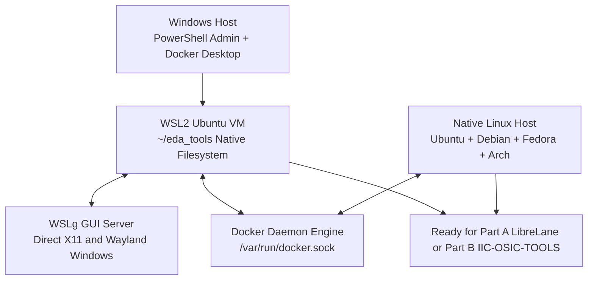

# 🪟 Part D: Setting Up WSL2 & Linux for Open-Source EDA Tools

<div align="center">

### 📑 **Quick Navigation Tabbed Header**
| 🏠 [Main Home](README.md) | ⚡ [Part A: LibreLane](README_PATH_A_LIBRELANE.md) | 🐳 [Part B: IIC-OSIC-TOOLS](README_PATH_B_IIC_OSIC_TOOLS.md) | 📖 [Part C: Manual Guide](README_MANUAL_INSTALL.md) | 🪟 [Part D: WSL & Linux](README_WSL_AND_LINUX.md) |
| :---: | :---: | :---: | :---: | :---: |

---

</div>

This guide covers **Part D** of the environment setup:
- **Windows users**: Complete this guide first to set up Ubuntu and Docker Desktop before proceeding to [Part A](README_PATH_A_LIBRELANE.md), [Part B](README_PATH_B_IIC_OSIC_TOOLS.md), or [Part C](README_MANUAL_INSTALL.md).
- **Linux users**: Skip the Windows/WSL sections and read the **Linux Users Section** below.

---

## 🗺️ Part D Visual Setup & OS Integration Map



---

## 🪟 1. Windows Users: Step-by-Step Setup

### Step 1: System Requirements Check
- **Windows Version**: Windows 10 (Version 2004, Build 19041 or higher) or Windows 11.
- **Hardware Virtualization**: Enabled in BIOS/UEFI (SVM Mode on AMD, Intel Virtualization Technology on Intel).
- Verify via Windows Task Manager -> Performance -> CPU -> "Virtualization: Enabled".

### Step 2: Automated WSL2 Setup (PowerShell)
You can automate the Windows preparation using [`scripts/wsl/wsl_setup.ps1`](scripts/wsl/wsl_setup.ps1):
1. Open PowerShell as **Administrator**.
2. Run:
```powershell
Set-ExecutionPolicy RemoteSigned -Scope Process
.\scripts\wsl\wsl_setup.ps1 -Path a
```
*Use `-DryRun` if you want to preview all actions without executing them.*

### Step 3: Manual WSL2 Installation (Alternative)
If installing by hand:
1. Open PowerShell as Administrator and run:
```powershell
wsl --install -d Ubuntu
```
2. **Reboot your PC** if prompted.
3. Open the newly installed **Ubuntu** app from your Start Menu.
4. Set your UNIX username and password when prompted.

### Step 4: Configure WSL2 Memory Limits (`.wslconfig`)
By default, WSL2 can consume up to 50% or more of host RAM, potentially freezing your Windows system during heavy synthesis runs.
Create a configuration file at `%USERPROFILE%\.wslconfig`:
```ini
[wsl2]
memory=8GB      # Recommended: 8GB or 12GB depending on system RAM
processors=4
swap=8GB
```
Restart WSL to apply:
```powershell
wsl --shutdown
```

### Step 5: Install Docker Desktop for Windows
1. Download and install Docker Desktop from the official site (version 4.37.1 or newer recommended) or run:
```powershell
winget install -e --id Docker.DockerDesktop
```
2. Open Docker Desktop -> Click the **Gear (Settings)** icon.
3. Go to **General** -> Verify **Use the WSL 2 based engine** is checked.
4. Go to **Resources** -> **WSL Integration**:
   - Turn ON **Enable integration with additional distros**.
   - Toggle the switch for **Ubuntu** to ON.
5. Click **Apply & Restart**.

### Step 6: Critical Performance Rule: Filesystem Location
> [!CAUTION]
> **DO NOT** clone or run EDA projects inside Windows drives (`/mnt/c/`)!
> Accessing Windows drives through WSL2 uses network virtualization (9P protocol), which makes synthesis and PDK indexing up to 10x slower.
> **Always clone into your native Linux home directory**: `~/eda_tools/` or `~/designs/`.

Inside Ubuntu:
```bash
mkdir -p ~/eda_tools
cd ~/eda_tools
git clone <your-repo-url>
cd <repo-name>
```

### Step 7: Graphical Applications (WSLg & VNC)
- **Windows 11 / Windows 10 (updated)** comes with **WSLg** built-in. Graphical windows (such as GTKWave, KLayout, and Magic) open directly as native Windows desktop windows.
- If graphical display fails or you are on an older build, use the browser-based VNC desktop provided by Part B (`./start_vnc.sh` at `http://localhost:80`).

---

## 🐧 2. Linux Users Section (Ubuntu, Debian, Fedora, Arch)

Linux users do not need WSL. Follow these steps on your native machine:

### Identifying Your Distribution
Run:
```bash
cat /etc/os-release
```
Check `ID` (e.g., `ubuntu`, `debian`, `fedora`, `arch`) and `VERSION_ID`.

### Docker Permissions (Non-Root Docker Group)
On Linux, the Docker daemon runs as `root`. Running `docker` without root privileges results in `permission denied`. 
> [!WARNING]
> Do NOT run installer scripts or Docker commands with `sudo`. Running with `sudo` causes generated output and PDK files to be owned by `root`.

Add your user to the `docker` group:
```bash
sudo groupadd -f docker
sudo usermod -aG docker $USER
```
To activate group changes without logging out:
```bash
newgrp docker
```
Verify sudo-less Docker access:
```bash
docker run --rm hello-world
```

### Rootless Docker vs Podman
- Rootless Docker has known limitations with X11/Wayland display forwarding.
- If rootless execution is mandatory, upstream recommends using **Podman** with `--userns=keep-id`.
- You can pass `--podman` to tool installer scripts or set `USE_PODMAN=1`.

---

## 📊 3. Resource Requirements

| Environment | Minimum RAM | Recommended RAM | Free Disk Space | Setup Time | Type |
| :--- | :--- | :--- | :--- | :--- | :--- |
| **WSL2 Ubuntu Base** | 4 GiB | 8–16 GiB | 15 GB | 10–15 min | Documented |
| **Part A (LibreLane)** | 8 GiB | 16 GiB | 25 GB | 15–25 min | Documented |
| **Part B (IIC-OSIC-TOOLS)** | 8 GiB | 16 GiB | 20 GB (4 GB download) | 10–20 min | Documented |
| **Part C (Manual Builds)** | 4–8 GiB | 16 GiB | 30 GB | 45–90 min | Estimate |

---

## 🛠️ 4. Troubleshooting Guide

### 1. `docker: command not found` inside WSL
- **Cause**: WSL Integration is not toggled on in Docker Desktop.
- **Fix**: Open Docker Desktop on Windows -> Settings -> Resources -> WSL Integration -> Turn ON toggle for `Ubuntu` -> Click "Apply & Restart".

### 2. `permission denied while trying to connect to the Docker daemon socket`
- **Cause**: Current user is not in the `docker` group.
- **Fix**: Run `sudo usermod -aG docker $USER` followed by `newgrp docker`.

### 3. Out-Of-Memory (OOM) Kill during Flow / Build
- **Cause**: WSL2 or Docker ran out of allocated memory.
- **Fix**: Increase memory in `.wslconfig` (e.g. `memory=12GB`) and re-run after `wsl --shutdown`.

### 4. GUI Window Does Not Open
- **Cause**: Missing X11/Wayland display server or broken `DISPLAY` variable.
- **Fix**: Ensure WSLg is updated (`wsl --update`). Alternatively, launch Part B via VNC: `start_vnc.sh` and access `http://localhost:80` in your Windows browser.
